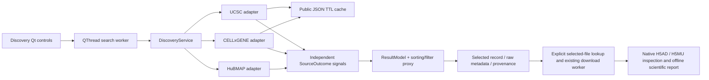

# Unified discovery workspace — 0.12.0 milestone 1

## Review and phased architecture

The previous desktop had three independent search forms backed by synchronous
adapters. Its modal worker already kept network activity off the GUI thread,
but searches could not report source results independently. HuBMAP stopped when
the first alias filled the result limit. UCSC filtered parent entries before
visiting their children and copied parent biology into child records. CELLxGENE
downloaded its entire public feed on each search; UCSC had no persistent catalog
cache. Publication and file availability were not represented independently in
the common result model.

1. **Implemented here:** shared query/result contracts, conservative metadata
   normalization, complete alias evaluation before limiting, recursive catalog
   discovery, bounded expiring public metadata caches, independent source jobs,
   and a Qt Discovery tab. Keep the existing advanced tabs, acquisition paths,
   Census controls and offline H5AD dashboard. Measure coverage and latency;
   expose every timeout, traversal bound and display limit.
2. **Next:** a versioned, resumable catalog index and bounded parallel collection
   fetching for UCSC cold starts; source-provided pagination/assay vocabularies
   for HuBMAP broad searches. Validate ontology mappings against repository
   identifiers before adding broader semantic search. No such completeness is
   claimed by this milestone.
3. **Later:** saved queries, evidence-based cross-repository relationships,
   richer acquisition planning and selected-file verification history. Dataset
   overlap, donor counts and biological replication require explicit source
   evidence; discovery row counts are not biological sample counts.

## Components and data flow



- `discovery.py` is Qt-independent. `SearchQuery` holds common and explicitly
  scoped advanced filters. Up to three source jobs run concurrently with
  independent budgets. `SourceOutcome` retains failures without discarding other
  sources. Source completion callbacks let the GUI show usable results early.
- `catalog_cache.py` owns JSON byte limits, cooperative deadlines, cache storage,
  expiration and HTTP revalidation. Only CELLxGENE/UCSC public metadata is cached;
  no H5ADs, credentials, authenticated HuBMAP responses or asset bodies enter it.
- `sources/*` retain their list-returning APIs; new keyword arguments are optional.
  `last_search` supplies counts, warnings, timings' supporting counters and
  catalog timestamps. Source identifiers and raw record metadata stay attached.
- `discovery_gui.py` owns the table model, proxy, filters, progress and selection.
  Selection maps through the proxy to `(source, dataset_id)`, never a visual row
  number. Model replacement restores that identity when still visible; removal
  or filtering clears the details and actions. Local filtering makes no requests.
- `gui.py` adds Discovery as the first tab and connects selected-record actions
  to existing file acquisition and CLT manifest code. All search and file lookup
  network work runs outside the GUI thread. Shutdown cancels and joins workers.

## Scientific result contract

The table separates source, title, tissue, assay, organism, reported observation
count, publication, access/file state and acquisition method. Missing source
metadata is displayed as **Not reported**. The adapters do not synthesize an
assay, assume human organisms, estimate counts, or copy collection totals to a
dataset. Results are source records; they are not deduplicated across repositories
and their cell counts must not be summed as unique cells or donors.

| Dimension | Meaning |
| --- | --- |
| `status` | Repository publication/lifecycle status. CELLxGENE's published feed supports Published. UCSC public catalog presence alone does not establish publication. |
| `access_level` | Source-reported access, or the public catalog's access context. This does not prove that every advertised asset is accessible. |
| `asset_status=not_checked` | No file availability conclusion has been established. |
| `advertised` | The metadata advertises a direct file; the endpoint has not been verified. CELLxGENE source H5AD acquisition preserves this distinction. |
| `verified` | Explicit selected-file lookup successfully probed a direct file. This is a point-in-time endpoint check, not content/integrity validation. |
| `transfer_only` | Reserved for affirmative source evidence of transfer-only access. No adapter assigns it merely because H5AD probes failed. |
| `checked_no_direct` | Selected candidate checks found no direct files. The candidate inventory may be incomplete. |
| `acquisition_methods` | Direct advertised/verified downloads and/or HuBMAP CLT/Globus. A CLT manifest is a transfer instruction file, not the dataset. |

CELLxGENE counts come only from `cell_count`; HuBMAP counts only from an explicit
`cell_count`, when present. HuBMAP `donor`/`donor_id` is retained separately.
UCSC `sampleCount` is the number of matrix observations retained with metadata,
not a donor count. Spatial matrices may include spots; the count-basis label says
so. See the [UCSC builder](https://github.com/ucscGenomeBrowser/cellBrowser/blob/master/src/cbPyLib/cellbrowser/cellbrowser.py)
(`convertMeta`, `sampleCount`, and `dataSummaries`). Source fields, catalog URL,
fetch time, query, scope limitations and collection lineage are retained in
provenance. The details display caps very large text at 100,000 characters;
the result retains its full bounded metadata object.

## Query semantics and unsupported filters

| Filter | HuBMAP | CELLxGENE Discover | UCSC Cell Browser |
| --- | --- | --- | --- |
| Keyword | Local substring over normalized title, identifiers, organ, assay and explicitly reported organism, before limiting | Substring over dataset/collection names and IDs and scientific label fields | Substring over published leaf catalog fields (including facets); an unmatched parent is always traversed |
| Tissue/organ | Exact parameter query for every friendly alias; kidney includes LK and RK | Case-insensitive tissue-label substring | Leaf body-parts/tissue substring; parent metadata is not inherited |
| Organism | Explicitly reported organism only; missing values do not match | Organism labels | Leaf organism labels/facets |
| Assay | Exact source values, with documented common aliases | Assay-label substring | Leaf assay-label substring |
| Scientific modality | Any selected conservative assay hint, before result limits | Any selected assay-label hint, before result limits and using the same cached catalog | Any selected leaf assay hint; collections are traversed regardless of parent modality |
| Disease/cell type | Unsupported; visibly marked as CELLxGENE-only | Supported label substring | Unsupported; visibly marked as CELLxGENE-only |
| Publication status | Source-specific advanced filter; default Published | Published public feed only | Not a publication filter |

Human/Homo sapiens and mouse/Mus musculus common-name equivalences are supported.
This is not ontology descendant expansion. HuBMAP `RNAseq` may include both
single-cell and single-nucleus datasets; its assay field alone cannot enforce a
nuclei-only biological selection. Arbitrary gene-expression, donor phenotype,
spatial resolution, age, sex, controlled-access authentication and Census/SOMA
expressions are not common discovery filters. Existing advanced source tabs and
optional Census controls remain available. Collapsing the new advanced panel
disables its filters for the next search.

The modality facet is multi-valued and separate from assay, tissue and organism.
`reported_modalities` and `modality_evidence` retain assay-derived hints; their
origin is `source_assay`. Titles and tissues do not assign modalities. Generic
"multiomics" does not automatically mean RNA+ATAC. Selecting a modality excludes
unclassified assays, so this is not a complete inventory of that biological
modality. Clear the facet to include unclassified records. No ontology identifier
expansion, feature inspection, spatial-unit filter or cross-modality pairing
filter is implemented.

`file_verified_modalities` remains empty during discovery. `local_inspection_support`
comes only from advertised filenames/formats and explicitly says contents are
not checked. H5AD/H5MU have bounded readers; Zarr, OME and imzML labels say
"Planned". There are no per-result asset probes. File evidence is produced by a
separate local inspection; this milestone does not automatically attach that
report back to the remote result or persist verification history.
See [the scientific profile/capability architecture](MODALITY_ARCHITECTURE.md).

HuBMAP aliases were checked against the
[official organ ontology endpoint](https://ontology.api.hubmapconsortium.org/organs?application_context=HUBMAP)
and [sample schema](https://docs.hubmapconsortium.org/param-search/schema-sample.html).
Kidney is LK/RK; no invented generic kidney code is queried. All requested aliases
are evaluated before applying the display limit. Bounded alias buckets are
interleaved, so a full LK response cannot prevent RK from being queried. Within
an alias, source response order is retained; this is not random sampling.
The [parameter search API](https://docs.hubmapconsortium.org/param-search/)
uses exact conjunctions and may redirect oversized queries. A missing redirect
location or upstream timeout triggers the static assay fallback. That fallback
is explicitly **partial**, even if all configured assay queries finish: the
static vocabulary cannot prove coverage of every current assay.

UCSC recursively visits collection nodes independent of parent matches. Current
leaf summaries (`sampleCount`) are searchable without downloading each leaf's
full configuration; legacy/unknown nodes are hydrated to distinguish leaves from
collections. Modern `facets` and older flat fields are supported. Selected-file
lookup hydrates the leaf separately. "Complete" means all reachable **published
catalog summaries** within this scope were traversed, not that every descriptive
field on every external portal page was indexed.

## Cache, limits and offline behavior

- Public cache TTL: **24 hours**. **Refresh catalogs + search** revalidates even
  fresh entries, using ETag/Last-Modified if provided. A 304 updates the validation
  timestamp without a body download. A failed refresh is an explicit source
  error/partial branch; expired data is never silently presented as refreshed.
- Path: `CELLONDESK_CACHE_DIR` override, otherwise
  `$XDG_CACHE_HOME/cellondesk/catalogs-v1` (fallback `~/.cache`) or
  `%LOCALAPPDATA%/cellondesk/catalogs-v1` on Windows. URL-hashed JSON envelopes use
  atomic replacement and a 256 MiB disk eviction budget. Cache writes are optional;
  an unwritable cache produces a notice while live discovery can continue.
- Metadata: 64 MiB decompressed per response, 128 MiB consumed per source job
  including cached reads. JSON decoding has bounded input, but Python object
  overhead means these limits are not peak-RSS promises. Source concurrency is
  capped at three; no full expression matrices or assets are read by discovery.
- Unified source deadline: 30 seconds, cooperative cancellation checked between
  requests, chunks and records; individual network timeouts are at most 10
  seconds or the remaining source budget. Socket/DNS and JSON-decoding work
  cannot be forcibly interrupted at a precise wall-clock boundary.
- UCSC: at most 2,000 visited/pending nodes and nesting depth 12. HuBMAP: at most
  100,000 examined candidates and bounded retained result buckets. Reaching any
  bound marks coverage partial. Malformed/unreadable branches are reported.
- GUI limit: 1–500 **per source**. CELLxGENE preserves its historical descending
  cell-count ordering, UCSC catalog traversal order, and HuBMAP alias interleaving.
  Display truncation is separate from coverage completeness. Partial `matched`
  counts are lower bounds, never total repository match counts.
- Fully cached, unexpired CELLxGENE/UCSC searches work offline. HuBMAP requires a
  network search and fails independently. H5AD inspection and single-file HTML
  reports remain completely offline and do not modify source files.

## Validation and measured results

Deterministic fixtures cover child-only and nested UCSC matches, no parent count
inheritance, kidney aliases and limit fairness, broad fallback, persistent
CELLxGENE/UCSC reuse, TTL/refresh/304, corrupt cache recovery, response bounds,
missing scientific metadata, cancellation, independent source failures and
selection through Qt sorting/filtering. Mock transports forbid asset probes.

Synthetic truth: **8/8 expected records found** (6 HuBMAP, 1 CELLxGENE, 1 UCSC).
Cold: 7 metadata requests. Repeat: 2 requests (HuBMAP only), 5 cache hits and no
CELLxGENE/UCSC network traffic. Exact timings are measured but not asserted in
tests, because elapsed time is machine-dependent.

Read-only live kidney metadata run, 2026-10-08, Python 3.10/Linux, limit 100/source:

| Source | First pass | Repeated/fully cached | Coverage observed |
| --- | --- | --- | --- |
| CELLxGENE | 10.59 s; 1 request; 9.74 MB JSON | 0.063 s; 0 requests; 1 hit | 2,238 inspected; 188 matched; 100 displayed (limited) |
| UCSC | 30.00 s; 220 requests; partial | Second pass 14.08 s completed remaining branches; fully warm 0.081 s, 0 requests, 321 hits | Full catalog traversal: 1,640 leaves inspected; 25 kidney matches; cold pass found only 15 |
| HuBMAP | 30.00 s; 38 requests | 30.06 s; 39 requests (not cached) | Broad endpoint required fallback; 778/839 unique matches examined in respective runs, 100 displayed; both runs partial |

These are observations of a changing public catalog and network, not universal
latency guarantees or proof of repository-wide biological completeness. No data
assets were downloaded or probed. Benchmark JSON and screenshots are generated
under ignored `build/discovery/`; the script records IDs and per-source counters.

```bash
python -m ruff check .
QT_QPA_PLATFORM=offscreen CELLONDESK_GUI_ARTIFACTS=build/discovery python -m pytest
python scripts/benchmark_discovery.py --cache-dir build/discovery/new-fixture-cache --output build/discovery/fixture.json
python scripts/benchmark_discovery.py --live --cache-dir build/discovery/new-live-cache --output build/discovery/live.json
QT_QPA_PLATFORM=offscreen python -c 'from cellondesk.gui import main; main(smoke_test=True)'
CELLONDESK_BROWSER_TESTS=1 python -m pytest tests/test_h5ad_browser.py
python -m build
python -m twine check dist/*
```

Use a new cache directory for a genuine cold benchmark; preexisting caches are
labeled `cached_start`. On Windows, set environment variables with PowerShell
`$env:NAME="value"`. Native Windows Qt tests, executable smoke, installer launch
and uninstall remain in `windows-desktop.yml`. This Linux implementation run
does not claim execution of a native Windows installer.

Real-data review scenarios: kidney with no assay and LK/RK coverage; kidney plus
an explicit assay alias; CELLxGENE kidney followed by brain with no feed re-fetch;
UCSC nested matches whose parent lacks kidney labels; forced refresh with a
disconnected source; fully warm offline catalogs; sort numeric counts, select a
dataset, filter it away and restore filters; resolve only that selected dataset,
export its CLT manifest where applicable, download an advertised H5AD, inspect
it locally and open the exported offline report. External download/transfer and
native Windows scenarios require separate integration runs; deterministic
acquisition tests and offline H5AD browser tests protect those existing paths.
